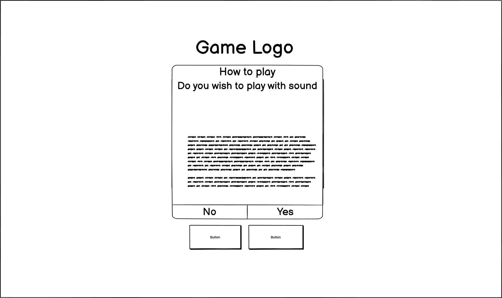

# Gameboy Fan Game

## User-Centric Front end Development Milestone Project.

![Project_image]

The Website presents a fully responsive browser based game, themed after the original gameboy and using the iconic graphics and sounds from the original pokemon titles.

This project is for educational purposes only.

The main aim of this project is to build a responsive website that uses HTML CSS and Javascript that displays interactivity with the page.

## [View Pokemon fan game in github pages]()
---

# UX

## Website owner business goals

The main goal of the website is to provide the user with a fun simple game, displaying competent use of html, css and javascript to achieve an interactive game that responds to the users inputs with animated tile flips and sounds.

aside from the basic logic of the game using javascript, I aim to be able to prompt the user whether they want sound enabled on page load and to be able to choose between a harder difficulty.

## User goals

### New user goals:
- select whether the game has sound or not.
- easily understand the premise of the game.
- be able to change between another game mode that provides more difficuty.
- interact with the game elements in order to complete the game.
- have the game reset in order to play again.

## User stories

### As a business owner:
* I would like to present my skills to the prospective employer or partner in the best light possible
* I need to make sure that the prospective employer can easily find the relevant information they need.
* I want the prospective employer to be able to see my level of ability through the quality of the website itself
* I would like to be able to arrange new social links and relationships through requested contact.

### As a new customer:
* I wish to find information about the candidate.
* I would like to contact the site owner easily.
* I would like to be able to find all relevant information needed on the page.

## Structure of the website

The website is a single page display containing a simple game in what I hope to be a clean and nostalgic throwback to the classic looks and sounds of the original gameboy, complete with a game that contains the sights and sounds of one of the most familiar games from the platform.

## Wireframes

I used the balsamiq programme to create the initial wireframes.

### Changes

### Colors

Main colours used in the project: rgba(138, 149, 107,0.9)
Text in paragraphs:color:black;

### Fonts 

* As a main font I used "PRESS START 2P", and as a backup font sans-serif

### Images

* I used a collection of images from the the classic pokemon games ripped from sprite sheets and converted to png with backgrounds removed via photo shop

https://www.spriters-resource.com/game_boy_gbc/pokemonredblue/sheet/8728/

https://www.spriters-resource.com/game_boy_gbc/pokemonredblue/sheet/36964/
___
# Features
The website consists of a single page with a title div, gamecontainer and a div housing buttons for the sound and the game mode.

The website has the below features:

## The How to play modal

* #### The how to play modal is called by javascript on page load and prompts with the option to play the game with or without sound.

## The Game

* #### The game is confined to the center of the page and consists of a grid containing a number of pokeballs the user must flip to reveal the pokemon and attempt to match.

    * The board consists of a repeated pokeball item image from the classic game
    * The flip side houses an image of one of the original 151 characters to be revealed and matched

       

## Game mode button

* The game mode button allows the user to dynamically enlarge the game board to provide a harder difficulty

## Sound

* If the player so chooses they may mute or unmute the games sound even after the initial selection at the how to play modal

##  Future implementations

* A method to track speed of completion and add it to a leaderboard

___
# Technologies used

### HTML5
* As a structure language.

### CSS
* As a style language.

### Javascript
* As a style language.

### Bootstrap 
* Bootstrap@4.6.2 as a CSS framework to keep responsive, mobile first aproach.

### Google fonts
* As a font resource.

### GitHub
* As a software hosting platform to keep project in a remote location.

### Git
* As a version-control system tracking.

### Gitpod
* As a development hosting platform.

### Balsamiq
* As a wireframing tool.

### Photoshop CS2
* As an image editor.

___
# Testing

## Functionality testing 

 I used Chrome developer tools throughout the project for testing and solving problems with responsiveness and style issues.

## Media Query / Resolution testing 

 

 

 

## Compatibility testing
 Site was tested across multiple virtual mobile devices and browsers. I checked all supported devices in Chrome developer tools. 
 
 I tested on hardware devices such as: Dell Latitude with Windows OS's, Huawei P30 smartphone with Android OS on google chrome browser and samsung A7 lite with Android OS.

## User stories testing

### As the Site Owner:

- I would like to present a fun game game with a pleasing aesthetic.
    >Site loads into game page with a clear visual direction towards what to do
- I want user to be able to quickly and easily understand the premise of the game.
    >on load the website provides the user with a modal displaying instructionson how to play.
- I want to make the game more immersive by adding sounds effect and a background track
    >the page loads music upon page load and sound effects are linked to the game elementns via javascript.
- The page cannot play music by default so I need to figure out a solution
    >the how to play modal gives the player the option to play with or without music before initiating play.
- I want the user to have more control over the audio settings
    >the user has access to a button that can mute and unmute all sounds at all times.
- I want the player to be capable of modifying the games diffuculty at any time.
    >the user has access to a game mode button that will increase or decrease the size of the gameboard and accompanying game pieces.

    

### As a new customer:
- Wish to be able to quickly start
    > user is immediately greeted by the game screen.
- I would like to understand the rules of the game
    > user is prompted with a how to play modal before initiating play.
- I would like to be able to control the sounds for the game
    >  the user is able to decide whether the sound effects are enabled both before play and during with a button located under the game board.
- I would like to be able to increase the difficulty
    >  the user has access to a game mode button that will increase the amount of game pieces leading to more challenge.

    
---
## Issues found during site development

I had issues when trying to intergrate audio into the game as chrome mutes any sound on page launch, I rectified this by adding the option to enable sound through the modal ensuring that the user was both agreeing to have sound on the page and interacting with the page before hand.

when employing the harder difficulty mode I ran into problems with the code understanding that the game cards that were invisble were not to be interacted with leading to a situation where the smaller easier gameboard would not reset on completion, through use of debugging in dev tools i found this to be an issue with the javascript conflicting with the elements css's display styling at default.

* #### 

when attempting to remove the stock boot strap color schemes with my own I decided to use the built in (btn-dark) feature to create a cohesive and intentional feel to the design.
* #### 

## Performance testing

I run [Lighthouse](https://developers.google.com/web/tools/lighthouse/) tool to check performance of the website.

## Code Validation
 At the and of the project I used two websites to validate a code
 
 * [W3C CSS Validator](https://jigsaw.w3.org/css-validator/) to validate CSS
 * [Nu Html Checker](https://validator.w3.org/) to test HTML

 
 

___
# Deployment

The project was deployed on GitHub Pages. I used Gitpod as a development environment where I committed all changes to git version control system.

## Repository

## Live link

## Copying the repository

A user can make a local copy of my repository by going to the GitHub repository page of my project and clicking on the "Code" button which will open a dropdown menu, select the protocol (HTTPS or SSH) for the clone URL and copy it to the clipboard.
Open a terminal on their local machine and navigate to the directory where they want to store the project then type the command "git clone" followed by the URL they copied in step 3, and press Enter.
Wait for the cloning process to complete.

## Clone link

## Forking the repository

To fork the repository the user can go to the GitHub repository page of the project and click on the "Fork" button in the upper right-hand corner of the page, select the account they want to fork the project to and then wait for GitHub to create a copy of the project in their account.
Once the fork is complete the project will be available under their account with the option to clone to their local machine.

___
# Credits

* To complete this project I used Code Institute student template: [gitpod full template](https://github.com/Code-Institute-Org/gitpod-full-template)

* Ideas and knowledge library:

    * [w3schools.com](https://www.w3schools.com)

    * [css-tricks.com](https://css-tricks.com/)

    * [getbootstrap.com/docs](https://getbootstrap.com/docs/4.6.2/getting-started/introduction/)

### Code

*

### Images:

back ground of project 1

https://www.pexels.com/photo/turned-on-silver-imac-with-might-mouse-and-keyboard-930530/ project image

boxing image

Photo by Andrea Piacquadio from Pexels: https://www.pexels.com/photo/close-up-photography-of-man-wearing-boxing-gloves-927437/

gaming image

Photo by Lucie Liz from Pexels: https://www.pexels.com/photo/flatlay-of-gaming-equipments-3165335/

fashion image 
 
Photo by Godisable Jacob from Pexels: https://www.pexels.com/photo/woman-in-brown-and-gray-t-shirt-sitting-on-brown-wooden-table-949670/

keyboard image 

https://www.pexels.com/photo/grey-laptop-keypad-60626/